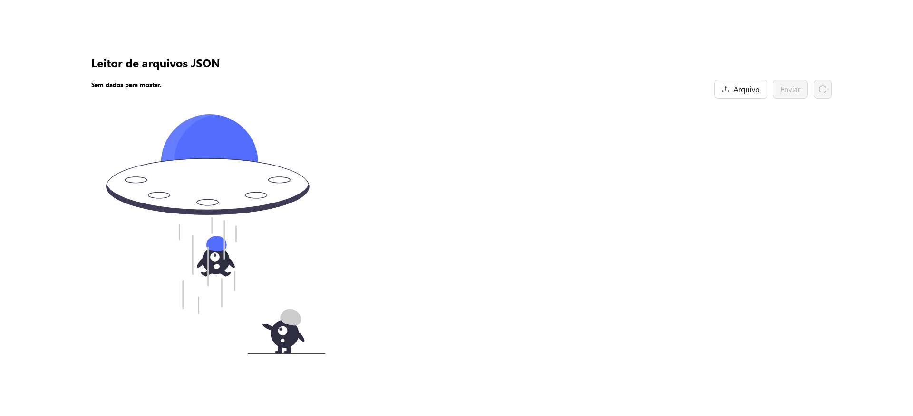

# Docker Application

This repository is intended for the development of a JSON file handler system.




## Table of Contents

1. [Technologies](#technologies)
2. [Install and Run](#install-and-run)
3. [About](#about)

## Technologies

A list of technologies used within the project:

* [Python](https://www.python.org): Version 3.12
* [FastApi](https://fastapi.tiangolo.com/): Version 0.112.0
* [NodeJS](https://nodejs.org/pt): Version 20.0
* [ReactJS](https://react.dev/): Version 18.3.1
* [AntDesign](https://ant.design/): Version 5.0
* [Docker](https://www.docker.com/)
* [Mockaroo](https://www.mockaroo.com/)
* [unDraw](https://undraw.co/)

## Install and Run

```bash
# Clone this repo
$ git clone git@github.com:jeniferss/DataEngineeringStudies.git

# Go into the repo app
$ cd dockerApplication
```

### Docker

```bash
# Install docker on your machine: https://www.docker.com/

# check if docker is running on your computer
$ docker info

# Create a network for both containers
docker network create <networkName>

# Go into the backend app
$ cd backend

# Create the image for the backend app
$ docker build . -t <imageName>

# Run the backend app (if the container name is different from 'backend,' remember to update it in your client proxy - in the package.json file)
$ docker run --name <containerName> --rm --network <networkName> -p 8000:8000 <imageName>

# Go into the frontend app
$ cd frontend

# Create the image for the frontend app
$ docker build . -t <imageName>

# Run the frontend app
$ docker run --name <containerName> --rm --network <networkName> -p 3000:3000 <imageName>
```

### Windows

```bash
# Go into the backend app
$ cd backend

# Create a virtual environment
$ python -m venv venv

# Activate your virtual environment
$ venv\Scripts\activate

# Install requirements
$ pip install -r requirements.txt

# Run the backend app
$ uvicorn main:app --host 0.0.0.0 --port 8000

# Go into the frontend app
$ cd frontend

# Install libs
$ npm i 

# Run the frontend app
$ npm start

```

### MacOS & Linux

```bash
# Go into the backend app
$ cd backend

# Create a virtual environment
python3 -m venv venv # or virtualenv venv

# Activate your virtual environment
source venv/bin/activate

# Install requirements
$ pip install -r requirements.txt

# Run the backend app
$ uvicorn main:app --host 0.0.0.0 --port 8000

# Go into the frontend app
$ cd frontend

# Install libs
$ npm i 

# Run the frontend app
$ npm start
```

### Server & Client & Docs

Server will start at: `http://127.0.0.1:8000`
Client will start at: `htpp://127.0.0.1:3000`
</br>
You can se the backend docs at: `http://127.0.0.1:8000/docs/`

## About

The goal of this project is to learn about best practices in software engineering, such as application containerization, which is highly advantageous as it allows applications to run consistently across different environments. For illustration, a backend application was created using FastAPI and a client in React, both operating within the same network in the Docker ecosystem. The focus is on handling JSON file manipulation. You can test the application using the files available in the `/data` directory.
