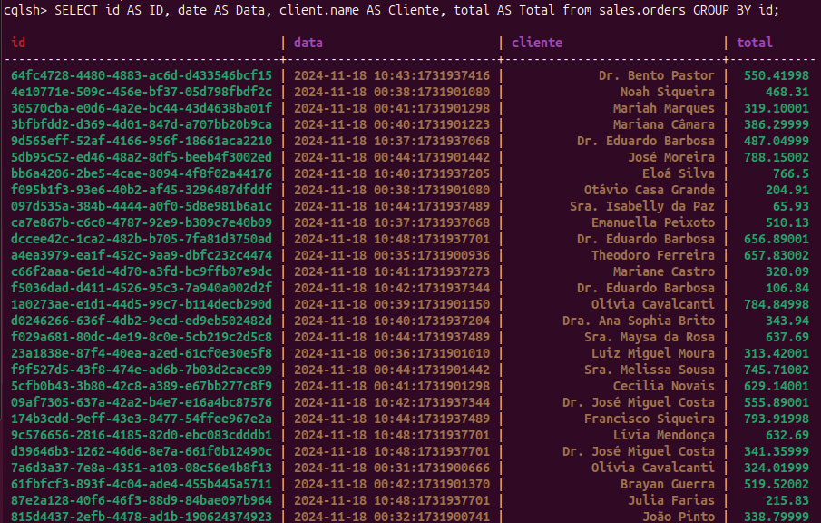

# Kafka, Spark & Cassandra

The objective of this project is to create a producer and consumer of sales data for an e-commerce platform using Kafka, Spark and Cassandra.

## Table of Contents

1. [Technologies](#technologies)
2. [Install and Run](#install-and-run)
3. [About](#about)
4. [Errors](#errors)
5. [Commit Patterns](#commit-patterns)

## Technologies

A list of technologies used within the project:

* [Python](https://www.python.org): Version 3.11.0
* [Pyspark](https://spark.apache.org/docs/latest/api/python/index.html): Version 3.5.3
* [Kafka](https://kafka.apache.org/): Version 3.0.8
* [Cassandra](https://cassandra.apache.org/_/index.html): Version 5.0 .2
* [Faker](https://pypi.org/project/Faker/): Version 30.8.1
* [Mockaroo](https://www.mockaroo.com/)

## Install and Run

```bash
# Clone this repo
$ git clone git@github.com:jeniferss/DataEngineeringStudies.git

# Go to the current branch
$ git checkout feat/atividade06
```

### Windows

```bash
# Create a virtual environment
$ python -m venv venv

# Activate your virtual environment
$ venv\Scripts\activate

# Install requirements
$ pip install -r requirements.txt

```

### MacOS & Linux

```bash
# Create a virtual environment
python3 -m venv venv # or virtualenv venv

# Activate your virtual environment
source venv/bin/activate

# Install requirements
$ pip install -r requirements.txt

```

### Run Kafka and ZooKeeper, Consumer, Producer & Cassandra

*Ensure that Apache Kafka is installed on your machine.*
*Ensure that Apache Cassandra is installed on your machine.*

**Important**: the producer will run continuously and will generate between 0 and 25 messages per minute. To stop it, just press **Ctrl + C** in the terminal.

```bash
# Open the terminal and navigate to the Kafka bin directory
$ cd /your/path/to/kafka/bin

# Start ZooKeeper service
$ ./zookeeper-server-start.sh ../config/zookeeper.properties

# Start Kafka service
$ ./kafka-server-start.sh ../config/server.properties

# Open a new terminal and navigate to the Cassandra directory
$ cd /your/path/to/cassandra

# Start Cassandra
$ ./bin/cassandra

# Open a new terminal and navigate to this directory
# Run consumer
$ python3 consumer.py

# Run producer
$ python3 producer.py
```

### Check if it is working
```bash
# Open a new terminal and navigate to the Cassandra directory
$ cd /your/path/to/cassandra

# Start CQLSH
$ ./bin/cqlsh

# Run this query and your output should be similar to the image below
$ SELECT id AS ID, date AS Data, client.name AS Cliente, total AS Total from sales.orders GROUP BY id;
```


## About

The objective of this project is to understand the functioning of an event-driven architecture, primarily focusing on the real-time reading of large volumes of data. For this, Kafka was used, which is a distributed event streaming platform designed for high-throughput data handling and fault tolerance. It allows for the efficient management of data streams, enabling applications to process data in real-time. A PySpark consumer using streaming is employed to process and analyze the incoming data streams.

The data in question comes from a simulated e-commerce scenario. The chosen product theme was supermarket products, and a sample was generated using the Mockaroo platform, while the data for orders and customers was created with the Python Faker library.

### Part 01
- [x] Create a message producer in Python that generates messages in an e-commerce sales format, containing: order ID, client document, purchased products, quantity of each product, total sale amount, date and time of the sale, using the Faker library.

### Part 02
- [x] Create a message consumer in PySpark that receives the data and saves it in a table in a Cassandra database.


## Errors

In the execution of this project, there were two errors, the solutions to which may not be necessary in your case, depending on the versions of the libraries and tools used. The first one was related to the `six` library: `ModuleNotFoundError: No module named 'kafka.vendor.six.moves' `; the solution to the problem is on line 12 of the `producer.py` file. The second one was related to supporting files in spark for Kafka streaming: `Failed to find data source: kafka. Please deploy the application as per the deployment section of Structured Streaming + Kafka Integration Guide.`; the solution to this problem can be found on line 28 of the `consumer.py` file.

Additionally, for the Cassandra version, two updates were required for compatibility. The first was the Java JDK update, where version 21 was changed to version 11. The second update was to run the CQL shell, which required using Python version 3.11.

## Commit Patterns

Clear commit messages help us understand the evolution of the code and make it easier to locate specific changes. With this in mind, it was created a prompt helper to assist in writing commit messages. The messages are categorized by type:

* feat: for new functionalities
* fix: for bug fixes
* refac: for code changes that don’t alter functionality
* docs: for documentation updates, such as changes to README.md
* test: for adding or modifying tests

Since this tool was developed using [Python 3.11](https://www.python.org/), please ensure that you have it installed on your computer.

Next, create and activate a [virtual environment](https://docs.python.org/3/library/venv.html). After activating the virtual environment, you can run the command: `pip install -r requirements.txt`.

Once the installation is complete, you’re good to go!

Before committing your changes, make sure you have followed all the necessary [Git Steps](https://git-scm.com/docs/gittutorial).

To run the script, use the command: `python commit.py`. If you need to exit the prompt due to an error or any other reason, simply press Ctrl + C.