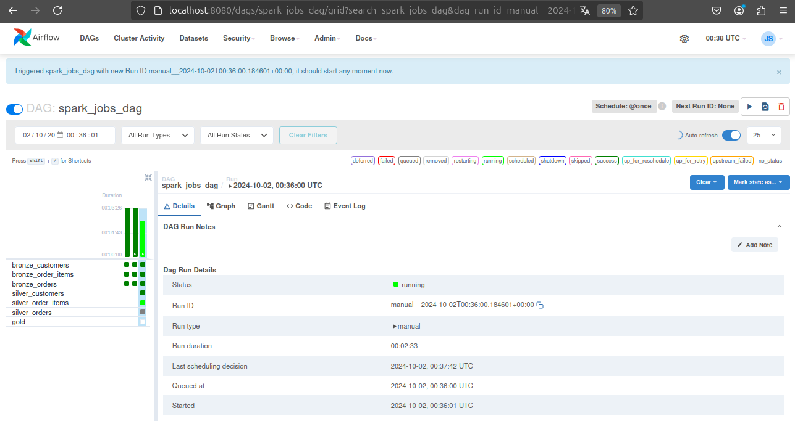

# Spotify Music Recommendation

This repository is intended for the development of a Spotify music recommendation app.




## Table of Contents

1. [Technologies](#technologies)
2. [Install and Run](#install-and-run)
3. [About](#about)

## Technologies

A list of technologies used within the project:

* [NodeJS](https://nodejs.org/pt): Version 20.0
* [ReactJS](https://react.dev/): Version 18.3.1
* [AntDesign](https://ant.design/): Version 5.0
* [unDraw](https://undraw.co/)

## Install and Run

```bash
# Clone this repo
$ git clone git@github.com:jeniferss/DataEngineeringStudies.git

# Go into the repo app
$ cd spotifyintegration
```

### Windows & MacOS & Linux

```bash
# Go into the frontend app
$ cd spotifyintegration

# Install libs
$ npm i 

# Create a .env file with the following variables:
# REACT_APP_CLIENT_ID="yourToken"
# REACT_APP_REDIRECT_URI="http://localhost:3000"
# REACT_APP_AUTH_ENDPOINT="https://accounts.spotify.com/authorize"
# REACT_APP_RESPONSE_TYPE="token"

# Run the frontend app
$ npm start
```

### Server & Client & Docs

Client will start at: `htpp://127.0.0.1:3000`

## About

The objective of this project is to practice building frontend applications using the React framework, as well as integrating and consuming APIs, including authentication and data manipulation to present to the end user.